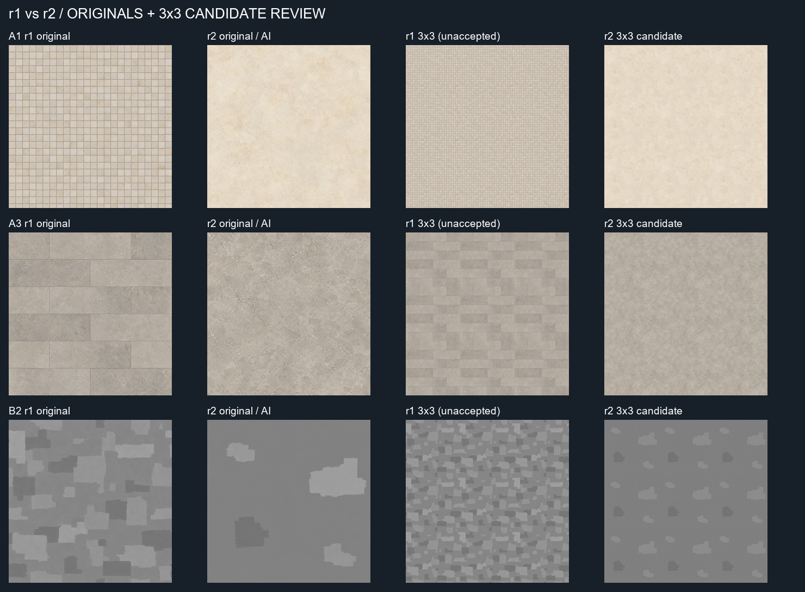
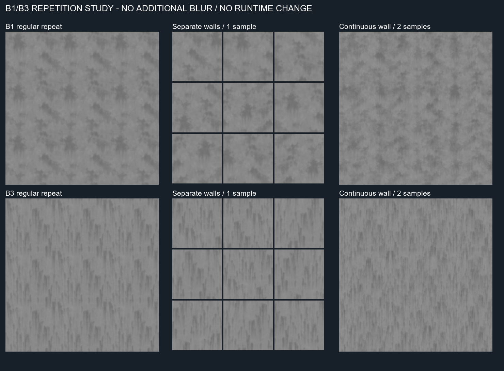
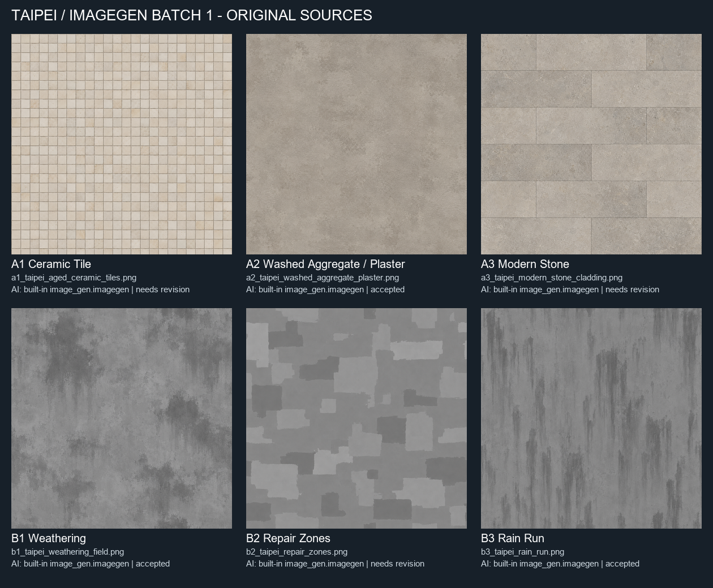

# Taipei material ImageGen batch 1

## Current focused revision: r2

Continues Draft PR #14 on `spike/xinyi-material-imagegen-batch1`, from
`ba96f8a8b4f820e5270b53dcbf967bb0739998f3`, verified equal to fetched remote pilot HEAD.
Three new independent `image_gen.imagegen` outputs, three attempts, no rejected r2 generations.
All three were inspected individually, against r1, and in 3x3 repeats. They are **offline candidates,
pending artistic review**, not production approval. A2, B1 and B3 candidates are retained byte-for-byte.

| Family | Active source | r2 result |
|---|---|---|
| A1 | `sources/a1_taipei_ceramic_surface_r2.png` | Continuous cream ceramic coloration without grout/grid. Quiet broad variations; fine mottling still needs engine filtering. |
| A3 | `sources/a3_taipei_stone_surface_r2.png` | Continuous warm-grey stone without rectangular joints. Mineral groups remain visible at close range; layout no longer fights procedural panels. |
| B2 | `sources/b2_taipei_sparse_repairs_r2.png` | Four separate repairs on a mostly untouched background. Substantially lower coverage; individual patch placement still forms a recognizable stamp in a strict repeat. |

New native outputs are 1254 x 1254. Versioned `normalized_1024/*_r2.png` copies and
`processed/*_r2_candidate.png` derivatives are 1024 x 1024. A1/A3 only use resize and the documented
64px border blend; no further blur. B2 is converted to L, its median recentered to 128, deviations
clamped to +/-12, and borders blended; no blur or noise generation. All three candidate edges match
exactly on both axes. That does not remove broad periodicity or prove invisible gradient joins.

B2 coverage proxy (pixels more than 6 levels from the image median) falls from **44.49% to 12.22%**,
about a 73% reduction. This measures tonal coverage, not exact semantic repair area. The new repair
shapes are fewer and larger than individual r1 patches; generated shapes do not exactly match every
requested metre dimension. Their sparse spacing meets the focused revision purpose.

### Future procedural layout plan (documentation only)

For A1, sample ceramic appearance independently of tile cells. Generate grout from wall-metric
coordinates, a deterministic tile period and narrow joint width; use pixel-footprint filtering and fade
subpixel joints to the area mean. Tile color variation can use the existing per-building/per-cell hash.
For A3, similarly generate panel IDs, neutral panel value offsets and joints procedurally, independent
of the continuous stone sample. Align any panel layout with facade composition; do not bake floor or
bay rhythm into the art. These plans add no implemented shader, Unreal content or runtime dependency.

### Retained B1/B3 repetition investigation

Left: regular three-period repeat. Middle: nine **separate wall swatches** with deterministic offsets,
horizontal mirroring and 0.9-1.1 scale. Gutters deliberately mark separate walls; this is not a continuous
seamless surface. These transforms retain one texture read and reduce synchronized repetition across
buildings, but do not remove periodicity within one large wall. Keep B3 vertical direction; no vertical
flip or 90-degree rotation. Recommended first low-cost approach, subject to later flight review.

Right: a continuous three-period view of an offline **two-sample** study:
`0.5*M(u,v) + 0.5*M(-1.37*u+0.371, 1.37*v+0.619)`, with variance restored to the baseline and values
clamped to 112-144. This is a mapping study, not a new tileable bitmap or independent AI source.
No additional blur was applied and no B1/B3 asset was replaced. One-tile-lag correlation falls from
1.0 to **0.48/0.55 for B1** and **0.47/0.44 for B3** (horizontal/vertical); standard deviation stays
within 0.5% of baseline. Runoff stays vertical. Small gradients increase, so extra shimmer is a future
motion-test concern. The second sample exceeds the current one-sample budget; retain as a comparison,
not the default recommendation. No GPU timing or engine benefit is claimed.

### Current package accounting and preservation

- Nine independent stored AI originals: six r1 plus three r2. Ten cumulative attempts, one r1 reject.
- Six active offline candidates: three retained plus A1/A3/B2 r2. Three historical r1 sources remain
  marked needs revision; they were not retroactively approved.
- Nine normalized copies; six processed candidates; six review sheets; **30 tracked PNGs** total.
- Zero production atlases, zero Unreal imports. All original and r1 derivative hashes match their archive.
- `manifest.json` selects active versions and records every source/derivative, prompts, hashes,
  processing, coverage and repetition measurements. `manifest_r1.json` preserves the previous manifest.
- Original review images are preserved as `review/contact_sheet_r1.png` and `review/tiling_review_r1.png`.

Validate with `python build_revision_r2.py --validate` or `python build_review.py --validate`.
Rebuild r2 with `python build_revision_r2.py`; committed originals suffice after initial ingestion.
The old builder refuses to overwrite the archived r1 package. Pillow/NumPy remain offline helper tools.
No Unreal, engine A/B, aircraft motion or performance test was run. No merge or branch creation.

## Historical r1 report (superseded active selections)

Six independent original AI sources for artistic review. **Three accepted as offline source candidates;
three need revision. This is not a production-ready six-material pack.** No Unreal integration or runtime atlas.

## Git baseline and scope

Fetched `origin/feat/opus55-xinyi-visual-quality` on 2026-10-09. Full remote starting SHA:
`ede7960d8ec05b2aa521b1e4c65b5bbd667c456d`. Required `ede7960` ancestry verified.
Created `spike/xinyi-material-imagegen-batch1` directly from that remote tracking commit in a
clean isolated clone. The pre-existing local checkout had untracked Unreal content and was left intact.
PR target: `feat/opus55-xinyi-visual-quality`; no merge is authorized by this package.

Read the library spec, facade-material pilot and facade-grammar v0A before generation.
The handoff explicitly asks for three color bases in addition to masks; this supersedes the older
mask-only generation queue for this isolated art study. It does not change the procedural palette strategy.

## Generation and provenance

Actual capability: **built-in `image_gen.imagegen`** through the imagegen skill. No stock textures,
web photos, Fab assets, copied repo images, or procedural noise substituted for source art.
Seven independent generation attempts: six selected original outputs, one rejected A2 aggregate attempt
for excessive speckle. The rejected image is not committed; its prompt, original filename, hash,
dimensions and reason remain in the manifest/log. Each selected image came from its own generation call,
without image references. The tool did not expose an underlying model ID, seed or reproducible request ID.
Generation date: 2026-10-09. Prompts are recorded in full in `manifest.json` and `generation_log.json`.

`sources/` contains byte-identical **1254 x 1254** native tool outputs, including embedded PNG metadata.
The requested 1024 size was not returned natively. `normalized_1024/` contains six clearly derived
1024 x 1024 review copies; these are not additional independent AI sources and are not all accepted.
A-series copies are RGB. The native B-series images are visually grayscale RGB with measured channel
drift of 5-7 levels; B-series normalized and processed copies are strict single-channel L PNGs.
No original file was overwritten or silently desaturated.

No third-party source licensing dependency is known. AI generation is the documented provenance;
uniqueness, legal clearance and provider training provenance were not independently certified.

## Artistic and tiling decisions

| ID / exact source filename | Status | Repetition result |
|---|---|---|
| A1 `a1_taipei_aged_ceramic_tiles.png` | Needs revision | Restrained off-white occupied-apartment tile identity, but partial border tiles and grout phase cause repeat joins on both axes. No accepted processed material. |
| A2 `a2_taipei_washed_aggregate_plaster.png` | Accepted for offline review | Revised fine mineral plaster is quiet enough; raw tonal edge steps corrected in candidate. Broad mottling still recurs. This represents the plaster option rather than strongly exposed aggregate. |
| A3 `a3_taipei_modern_stone_cladding.png` | Needs revision | Credible neutral matte stone; running-bond joints fail to close across tile boundaries. Fine grain also needs distance filtering. No accepted processed material. |
| B1 `b1_taipei_weathering_field.png` | Accepted for offline review | Broad damp shapes retained after low-pass, level remap and border blend. Edge jump removed; recognizable stain groups still recur at the 32m period. |
| B2 `b2_taipei_repair_zones.png` | Needs revision | Distinct human repaint structure, but coverage is excessive, patches are oversized, and repetition becomes camouflage-like. Border-clipped patches remain. No accepted processed material. |
| B3 `b3_taipei_rain_run.png` | Accepted for offline review | Uneven vertical runs retain gravity direction after low-pass and border blend. Edge jump removed; group repetition remains visible. |

All six were directly inspected individually and in the final sheets. No windows, building elevations,
text, people, brands or strong directional sunlight were seen. A1/A3 fine construction detail is a
close-view source study, not evidence of aerial benefit. B1/B3 sources were too finely textured to use
unchanged; derivative filtering is mandatory for the accepted candidates.

The compact tiling sheet shows unaltered-source 3x3 repeats on the left, accepted derivative 3x3 repeats
on the right, and explicit revision placeholders where no derivative was accepted. The contact sheet
shows all six original samples with filenames, labels, generation method and review status.

### Documented deterministic processing

Implemented in `build_review.py` (offline Pillow/NumPy helper only; no runtime dependency or dependency
manifest change): Lanczos resize to 1024; explicit L conversion for masks. For B1/B3 only, Gaussian blur
sigma 8px (~0.25m at the proposed 32m wall span), then linear min/max remap to numeric 112..144.
For A2/B1/B3, opposing border samples blend toward their shared average over 64px, with
`weight = 0.5 * (1-i/63)^2`, horizontal then vertical. No mirrored extension, generated noise or
invented replacement shapes. This changes the edge band and can soften features there.

Candidate opposing-edge MAE is **0 on both axes** (8-bit values), independently asserted by validation.
Matching pixel boundaries is a technical check, not proof of invisible repetition or gradient continuity.
Every source and output has a SHA-256; raw edge metrics are included in the manifest.
No gamma conversion is hidden: masks are numerical grayscale authoring data, not imported textures.
Any later engine import must explicitly choose linear/non-sRGB sampling and the agreed mask semantics.

### Distance limits

No Unreal, flight, performance, lighting or A/B test was performed. At the documented 1080p / 60-degree
vertical FOV assumption, a 2m feature projects to approximately 12/6/3/2px at 150/300/600/800m.
The 32m mask mapping is a proposal inherited from the spec. These sheets do not establish in-engine scale
or lack of shimmer; subpixel tile joints and stone grain should not drive the eventual aircraft material.
Final artistic review must judge broad material identity, maintained ageing intensity and repeated groups.

## Counts and validation

| Category | Count |
|---|---:|
| Generation attempts | 7 |
| Rejected generation attempts | 1 |
| Selected independent AI originals | 6 |
| Accepted independent sources for offline review | 3 |
| Selected sources needing revision | 3 |
| Normalized 1024 review copies | 6 |
| Accepted processed game material candidates | 3 |
| Total derived asset images (normalization + processing) | 9 |
| Review sheets | 2 |
| Total tracked PNG files | 17 |
| Production atlases | 0 |
| Images imported into Unreal | 0 |

Validation: all 17 PNGs decode; native originals are 1254 square; nine asset derivatives are 1024 square;
all six B-series derivatives are L; manifest hashes match; both review sheets contain six labeled entries;
candidate borders match exactly; original copies match the tool output bytes. The manifest distinguishes
source acceptance from eventual artistic approval. No missing planned source, but only half of the pilot
currently qualifies for further material-candidate review.

Portable audit from this directory: `python build_review.py --validate` (Pillow and NumPy needed).
Rebuilding initially copies the native tool files referenced in `generation_log.json`, so it uses the
author's local generation paths; validation only uses the committed package.

No Unreal runtime, shaders, geometry, generated UE content, main branch or existing Draft PR changed.
Stop at Draft PR review. No Unreal integration or merge has occurred.
