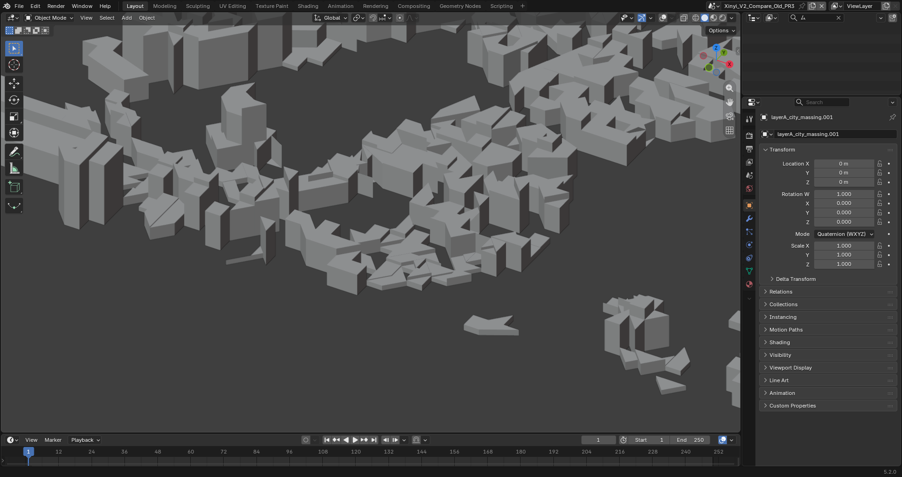
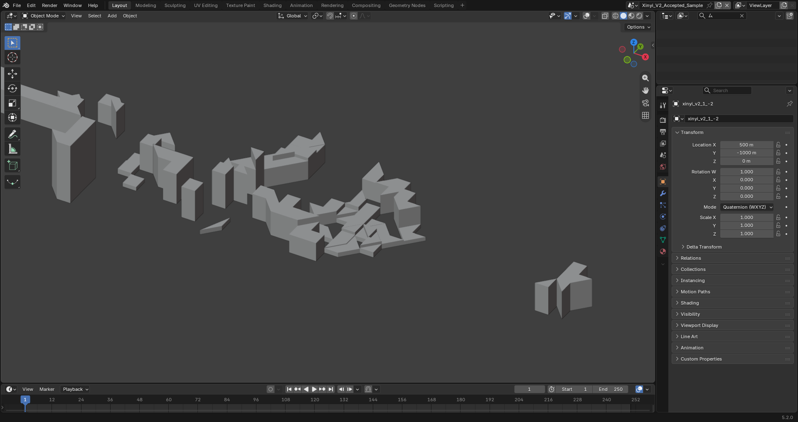
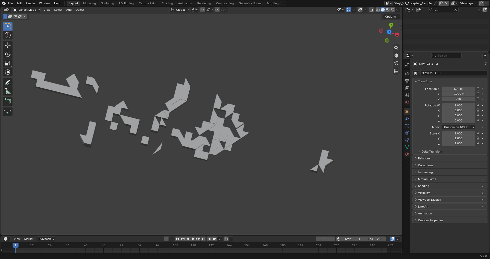
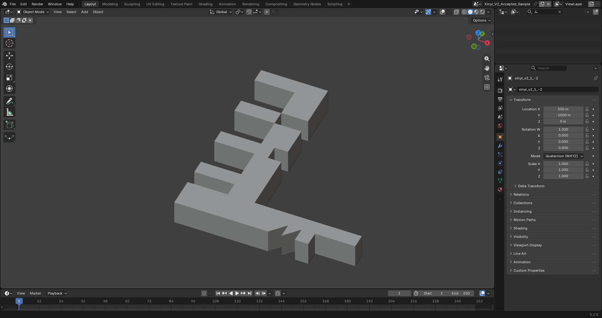
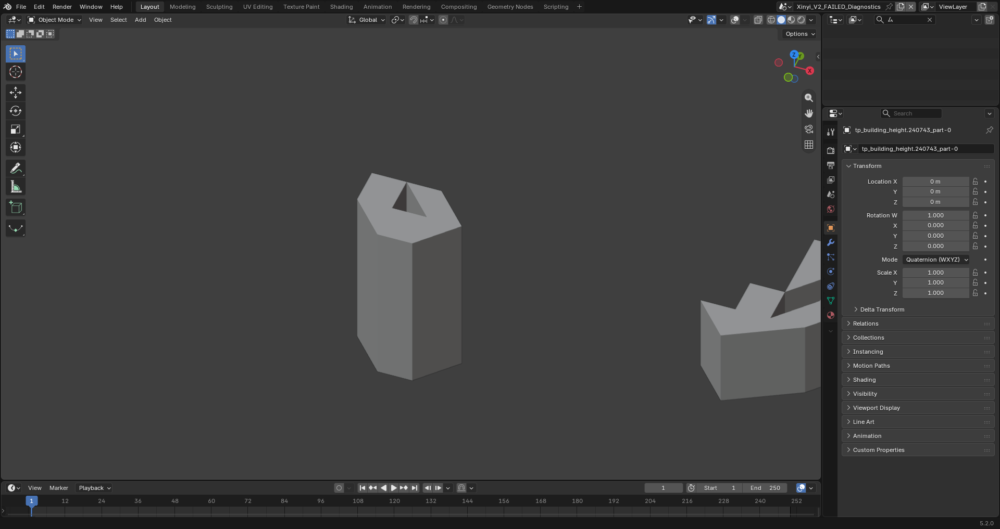

# Xinyi mature-library whitebox v2: sample gate failed

Date: 2026-09-20, Asia/Taipei. Issue [#5](https://github.com/eddy121384-ui/air-combat-world/issues/5).
Branch: `feat/xinyi-robust-whitebox-v2`, independently created from freshly fetched
remote main `08afe383d1b89a745f78f17d1930a75f045cec7a`.

**This spike is not a successful city replacement.** The parallel mature-library
path, exhaustive input accounting, deterministic representative meshes, and
official Blender inspection are complete. The representative acceptance gate
fails, so full Xinyi generation and Unreal import were deliberately not started.
There is no facade, lighting polish, gameplay, or Basin generation in this PR.

Read before implementation: [issue #2](https://github.com/eddy121384-ui/air-combat-world/issues/2),
[draft PR #3](https://github.com/eddy121384-ui/air-combat-world/pull/3), and
[PR #4's pipeline findings](https://github.com/eddy121384-ui/air-combat-world/blob/60e25a0d8659665c8ffe781b7debbd561f412b5b/docs/taipei-city-pipeline-findings.md).
PR #3 remains independent, open and experimental. Its code was not merged or
copied into this branch. Existing compiler, pinned input, old GLBs, Unreal assets,
canonical clean level and project rendering settings remain untouched.

## What the libraries established

Two problems must be separated:

1. **The source has already lost building-scale geometry.** All 290,568 coordinate
   values in the pinned GeoJSON lie on a 0.0001-degree grid: 10.0863 m east by
   11.1319 m north at the existing ENU origin. Many recorded rings repeat one or
   two points. GEOS cannot reconstruct a real building from a collapsed line or
   point. Of the polygon components it can recover, 1,817 / 5,789 have triangular
   exteriors. Replacing the triangulator cannot make those footprints rectangular
   while also preserving the supplied footprint.
2. **OGC-valid polygons are not automatically safe manifold extrusions.** The
   first-choice library stack still exposes point-contact courtyards, a separated
   courtyard triangulation/seam case, and precision-degenerate triangles. The
   numerical gate catches these instead of declaring a successful city.

The first observation is about the committed snapshot, not an assertion that
Taipei's original survey has only 10 m precision. The existing fetch script
passes `feature.geometry` through unchanged. This run did not re-fetch data or
prove where upstream rounding originated. The exact real-world footprint of a
collapsed source feature is unknown.

## Parallel implementation and dependencies

New production-spike code is confined to `tools/citygen_v2/`, with new tests and
evidence. No legacy polygon cleanup, hole bridge, triangulation, extrusion, or
GLB exporter is used by `build.py`.

| Dependency | Pinned version | Role |
|---|---|---|
| Shapely / bundled GEOS | 2.1.2 / 3.13.1 | Validity, linework repair, hole preservation, exact normalization, coverage QA |
| trimesh | 5.1.0 | Extrusion, topology, volume, flat shading, GLB export |
| mapbox-earcut | 2.1.0 | Explicitly selected mature triangulation backend |
| NumPy | 2.5.3 | Float32 serialization checks and vector arithmetic |
| psutil | 7.2.2 | Windows peak working set |

Installed into the ignored local Python 3.12.10 virtual environment, not global
Python. Shapely's documented [linework repair](https://shapely.readthedocs.io/en/2.1.1/reference/shapely.make_valid.html)
retains edges and can return polygon plus lower-dimensional remnants; those
remnants are logged. Trimesh's documented [extrusion API](https://trimesh.org/trimesh.creation.html)
accepts the explicit earcut backend. This first-choice stack required no custom
fundamental geometry algorithm. No alternate backend was silently substituted.

The unchanged WorldModel supplies surveyed heights, origin, ENU conversion and
hero suppression. Its v0 record omits interior rings. The v2 adapter joins by
stable source ID, verifies exterior coordinates/heights against WorldModel,
and includes every source interior ring. The coordinate frame is unchanged:
ENU meters -> glTF `(east, up, -north)` -> Blender `(east, north, up)`.

## Exhaustive input accounting

Pinned source SHA-256:
`cc70f0b890c66f298ce504840151abc05b457a5346e854f1accf19432268a848`.
Validity below is evaluated in the existing ENU meter frame, not square degrees.

| Input / outcome | Count |
|---|---:|
| Source features / WorldModel features | 11,132 / 11,132 |
| Polygon features | 0 |
| MultiPolygon features | 11,132 |
| Source polygon parts | 11,136 |
| Parts valid as supplied | 3,276 |
| Parts with usable polygonal output after GEOS repair | 2,001 |
| Parts legitimately rejected after GEOS repair | 5,859 |
| Unaccounted source parts | **0** |
| Input interior rings / parts containing interior rings | 1,200 / 715 |
| Parts containing repeated vertices, excluding ring closure | 10,783 |
| Parts with input area <= 1e-6 m² | 5,903 |
| Polygon components after repair, before meshing/hero exclusion | 5,789 |
| Remaining real area holes after GEOS repair | 54 |
| Repaired parts also containing recorded collapsed remnants | 1,591 |
| Hero-suppressed features / parts | 8 / 8 |
| Nonhero parts with polygonal area / unique features | 5,271 / 5,268 |

GEOS input reasons: valid 3,276; too few distinct points 5,724; ring
self-intersection 931; self-intersection 1,195; disconnected interior 10.
The rejected results are **3,486 LineStrings + 562 MultiLineStrings + 1,811
Points = 5,859**. They are rejected for having no polygonal area after repair,
not because their surveyed height is missing. No square footprint is invented.

The mutually exclusive terminal outcomes sum to 11,136. Hero suppression is a
separate assembly flag, not a disguised geometry rejection. Six hero parts have
polygonal area and two collapse; all eight keep their WorldModel suppression
metadata. Near-zero input area is an observation, not the rejection algorithm:
some self-intersecting zero-signed-area rings are repairable.

Every source part and its explicit reason is in
[the complete compressed JSONL ledger](evidence/citygen-v2/parts.jsonl.gz).
It expands to 11,136 records / 8,928,465 bytes. Full collapsed-component WKT is
retained. [Accounting](evidence/citygen-v2/accounting.json) and
[selected parts](evidence/citygen-v2/selected-parts.json) are directly readable.

### Rechecking the old `zero_area=5296` claim

`diagnose.py` invokes the unchanged old triangulator only for historical
classification, never for v2 generation. Hero parts are excluded here, matching
the old generator's behavior.

| Old classification | GEOS terminal outcome | Parts |
|---|---|---:|
| zero_area | rejected, no polygonal area | **5,296** |
| emitted | valid as-is | 3,276 |
| emitted | repaired | 1,986 |
| emitted | rejected, no polygonal area | **560** |
| self_intersecting | repaired | 9 |
| self_intersecting | rejected | 1 |

Thus the old 5,296 count is independently confirmed for this pinned snapshot;
it was not assumed. The full-ring audit additionally rejects 560 parts the
exterior-only old compiler emitted. Detailed provenance is in
[diagnosis.json](evidence/citygen-v2/diagnosis.json).

## Representative spike

80 source parts from 79 features. Deterministic selection labels overlap:
8 rectangles, 8 concave, 8 complex, 8 courtyard, 8 repaired, 4 multipart-source,
37 low-rise parts nearest the previous PR #3 failure at ENU approximately
(-900, -900), and 3 fill parts. The source is all MultiPolygon; the multipart
selection specifically includes features with more than one polygon part.
36 repaired/retained components in this selection have triangular footprints.

The tests check finite coordinates, watertight topology, consistent winding,
positive volume equal to footprint area times surveyed height, roof-up/base-down,
complete cap coverage (including holes), no overlapping cap triangles, outward
walls including courtyards, and no zero-area triangles. Local mesh positions
are tested after float32 quantization. Independent Blender import remains a
separate mandatory gate, since node transforms can introduce further rounding.

| Measured sample result | Value |
|---|---:|
| Parts attempted | 80 |
| Parts passing local mesh checks | 69 |
| Parts explicitly failing local mesh checks | **11** |
| Local-pass GLBs / diagnostic GLBs | 11 / 1 |
| Local-pass triangles / flat-shaded exported vertices | 1,516 / 4,548 |
| Local-pass GLB bytes / all GLB bytes including failures | 183,128 / 246,876 |
| Whole-input audit time | 5.771 s |
| Selection and reporting time | 0.861 s |
| Representative mesh generation, QA and export | 0.658 s |
| Total timed build, excluding Python/module startup | 7.289 s |
| Process peak working set | 173,850,624 bytes (165.8 MiB) |

Timings are one observed warm workstation run, not a benchmark guarantee. Stats,
selection, failures, per-component results and hashes are in
[sample.json](evidence/citygen-v2/sample.json).

Eight of the nine non-watertight failures have courtyard/exterior point contact
(one has two contacts). These polygons are GEOS-valid but the extruded shared
vertical edges have more than two incident faces. The ninth,
`tp_building_height.241071`, has a separated courtyard (4.59 m clearance) yet
earcut/trimesh produces a four-incident-face outer edge; it must not be dismissed
as inherently bad source topology. Further mature-backend investigation is
needed. `272088` includes a near-self-contact and degenerate triangles; `269106`
has near-collinear cap triangles that reverse after float32 conversion.
Per-case WKT, bad-edge positions and incidence are preserved in diagnosis.json.
No per-building patch, hole bridge, polygon inflation, or replacement triangulator
was implemented to force these cases through.

## Official Blender inspection and visual verdict

Imported through **blender_official**, Blender 5.2.0 LTS. New scenes preserve the
existing unsaved scenes. No building was manually reconstructed, repaired,
exported, or given a two-sided material. Screenshots use neutral Solid mode with
backface culling enabled. Blender was activated to resolve stale screenshots,
and each final view was inspected. The helper is checked in.

Independent imported local-pass meshes: **297 upward roof triangles, 297 downward
base triangles, 918 walls, 4 zero-area triangles, no nonfinite vertices**. This
is a failed Blender gate even though the 69 parts passed the preceding local
checks. The failed diagnostic GLB also contains wrong caps and a zero-area face.
Its contents are evidence only. See [Blender measurements](evidence/citygen-v2/blender-inspection.json)
and the [failed gate receipt](evidence/citygen-v2/gate.json).

The old comparison is the preserved PR #3 GLB, SHA
`392011ccbbf1180784a496a2d9a2a9e21e5769f92785bc6d6053f8c6a2655586`, not a new
main build. Its ordinary mesh independently reproduces 190 wrong roofs,
190 wrong bases and 20 zero-area triangles. **Old is a full tile; v2 is only the
representative subset.** Their totals and empty spaces cannot be treated as a
full-city completeness comparison.

| Required question | Observed verdict |
|---|---|
| Coherent whitebox city? | **Not established / gate failed.** Some individual masses are coherent, but this is an incomplete sample with known defects. |
| Folded/triangular artifacts gone? | **No.** Most sample caps are coherent, but jagged/triangular massing remains in the recorded footprints and numerical defects persist. |
| Meaningful footprints preserved? | Concave shapes and recoverable courtyards are retained; coverage QA compares to GEOS output. Lost survey detail cannot be recovered or certified. |
| Visually obvious missing regions? | Full-city coverage is not evaluated. Sample empty areas are intentional selection; 11 failed parts are separately displayed. Whole-source rejection of 5,859 parts is a serious completeness blocker. |

Same camera: target (-890,-880,10), eye (-770,-1090,180), ENU meters.

## Taipei Basin scaling assessment

Xinyi is only the approximately 2 x 2 km method-validation tile. No workflow that
requires manual rebuilding per district is acceptable. This spike requires no
manual reconstruction, but **this source-plus-stack combination is currently
unsuitable for production** because the source/detail and solid-geometry gates
fail. It is not evidence that all mature-library approaches are unsuitable.

The prototype establishes automatic 500 m ENU tile ownership, complete uncut
building parts, local vertex coordinates, deterministic names and content hashes.
The source audit identifies **25 potentially occupied cells**, with 22–660
polygonal nonhero parts per cell, without generating full Xinyi. Grid alignment
and feature overlap explain why this is not exactly a 4 x 4 grid. Each cell is
one merged ordinary mesh/GLB, rather than one asset per building. A future hero
asset stays separate. No monolithic city mesh is required.

| Concern | Evidence / scalable path / remaining limitation |
|---|---|
| Source quality | First bottleneck. Obtain a precision-preserving, separately pinned source and establish a global validity policy; do not hand-fix districts. Current snapshot cannot supply thousands of footprints. |
| Geometry runtime | 80 representative parts took 0.658 s for extrusion/QA/export; 11 failed. A purely linear same-mix estimate for 5,271 polygonal parts is about 43 s, **not a measured full-tile result**. Quality and backend behavior must be solved first. Tile jobs can run independently with bounded concurrency. |
| Memory | Peak 165.8 MiB for the snapshot/sample. The current adapter eagerly loads GeoJSON, WorldModel and ledger; it is not a bounded-memory Basin loader. Stage into a spatially indexed cache/partitioned WorldModel and process one ownership cell per worker, writing ledgers incrementally. This change is required before Basin generation. |
| Tile and asset counts | 500 m cells imply about 4 cells/km² plus boundary cells. The config's 20 x 20 km detail core means roughly 1,600 cells; its 40 x 40 km playable envelope means roughly 6,400. These are rectangular planning scenarios, not a surveyed Basin mask or measured final asset counts. |
| GLB/import burden | Roughly one ordinary GLB/static mesh per occupied cell plus heroes/shared materials. Thousands of Interchange imports and asset saves would become a substantial engine-side cost. Use incremental hash-based reimport, batches and shared material mapping. Actual UE time/memory was not measured because its gate was not reached. |
| HLOD/streaming | Place tile actors by explicit ENU origin, register crossing-building bounds, stream with a halo so owners remain loaded when their overhanging geometry is visible. Build hierarchical raster HLODs for distant districts and World Partition cells for nearby tiles. Avoid one actor per footprint and avoid loading all cells at once. HLOD generation and mobile budgets remain untested. |
| Coordinate precision | Tile-local float32 reduces large-coordinate error; this experiment shows node/world transforms still need independent QA. Basin-scale ENU approximation accuracy and UE world-origin handling need validation before expansion. |

No Basin source was fetched and no Basin meshes were generated. These are
architecture requirements with a small tiling prototype, not a claim that the
current eager loader or UE streaming implementation is already production-ready.

## Unreal and Taipei 101

**Not reached.** No `/Game/Taipei/XinyiV2/` assets or comparison level were created.
Full Xinyi metrics are **not available**, not zero. No attempt was made to use
Unreal to conceal upstream defects. Nanite, SM6 requirements, Lumen, VSM and the
mobile raster settings remain unchanged.

The existing known hero point (121.5645, 25.0337), ENU origin and eight-record
suppression are retained by the adapter. The untouched old hero was independently
measured in Blender at exactly **508 m**. A v2 hero export/import was deferred
with full generation; it is not claimed verified.

## Verification and reproducibility

`python -m unittest discover -s tests -v` under the pinned virtual environment:
**21 passed, 0 skipped** (9 new v2 tests and 12 baseline tests). Tests verify both
ordinary fixtures and real-data blockers; a passing test suite correctly does
not turn a known sample rejection into a successful city gate. The baseline
exporter still emits its pre-existing unclosed-file ResourceWarning.

Independent reruns produced byte-identical 12 GLBs (11 candidates + diagnostics),
identical full part ledgers and identical classifications/failure lists.
Timings/peak memory are intentionally variable. Generated meshes remain ignored
under `unreal/Saved/CitygenV2/`; compact evidence is committed. Reproduction
commands and official MCP inspection steps are in
[tools/citygen_v2/README.md](../tools/citygen_v2/README.md).

The next review decision is whether to authorize a precision-preserving source
investigation and a general mature-backend treatment of the measured seam/contact
cases. This spike stops here. No facade or visual polish should begin on these
outputs.
